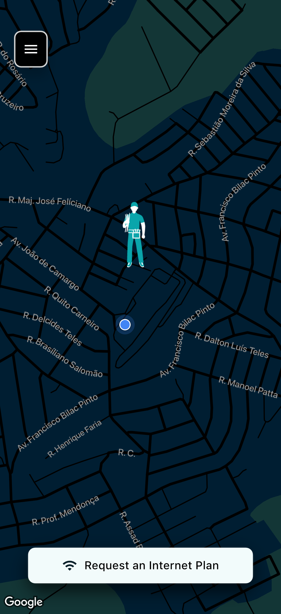
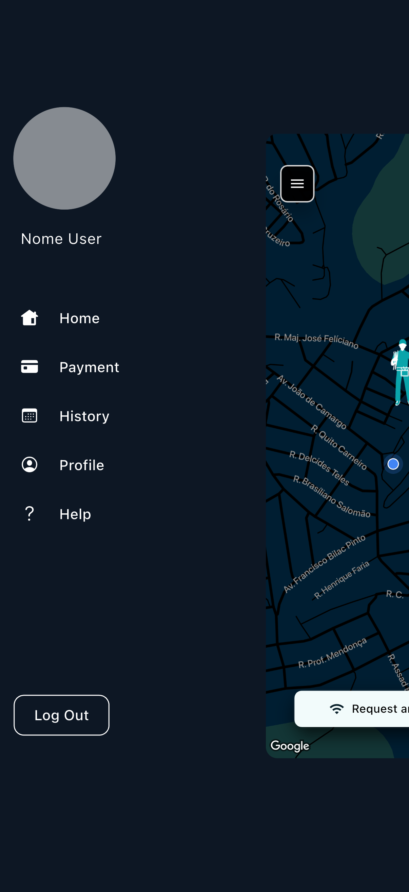
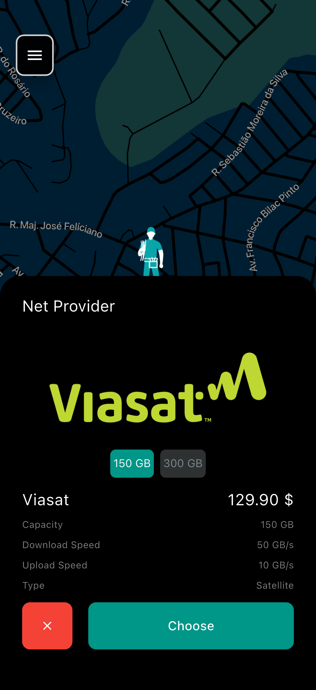
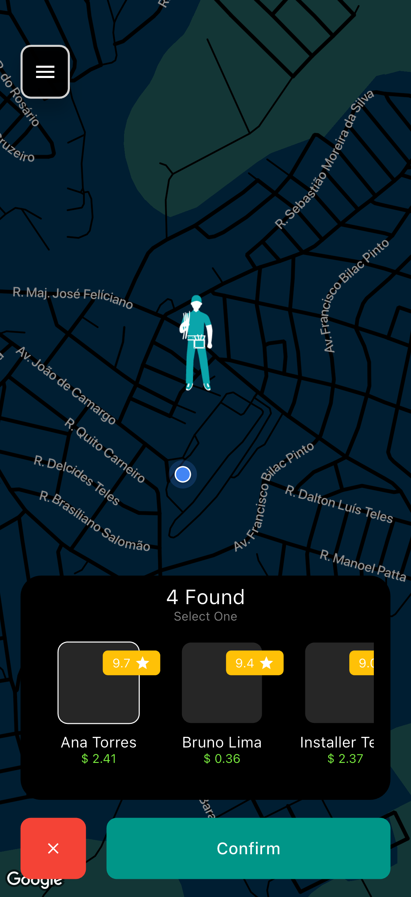
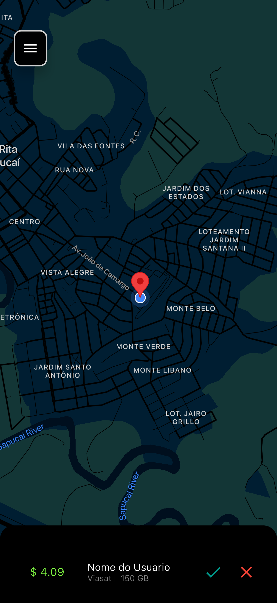
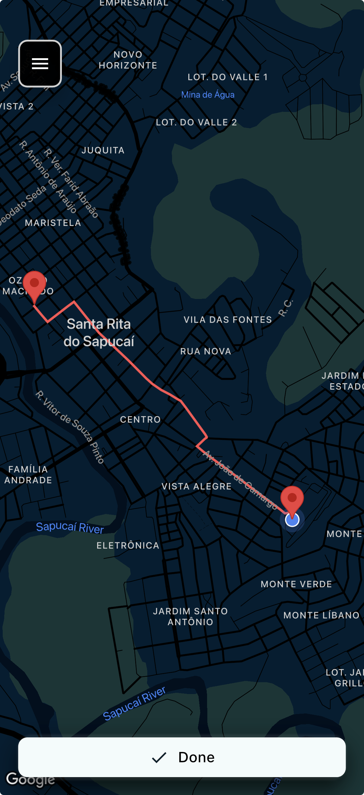
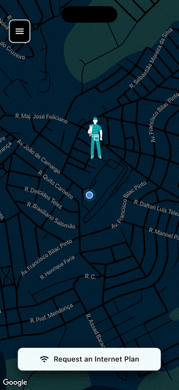

# Inatel App Challenge


A Flutter mobile app prototype designed to make internet plan hiring easier.

The project was created during **Inatel APP Challenge #2**, a time-boxed mobile app
development hackathon held in 2022 as part of
[Inatel](https://inatel.br/home/)'s Computer Science Week. The event brought
together 41 projects from Inatel students and collaborators and was organized in
partnership with the multinational company [Viasat](https://www.viasat.com).
The challenge was to create an app, in a short amount of time, that could help
users find and hire internet plans more easily.

The app explores an Uber-like flow for internet installation: users compare
available plans, choose an installer nearby, and send an installation request
through a map-based experience.

---

## Features

- Map-based experience powered by Google Maps.
- User mode for browsing providers, plans, and nearby installers.
- Installer mode for viewing and accepting installation requests.
- Local demo data for providers, plans, installers, and requests.
- Current-location support through device location permissions.
- Route preview between installer and customer location.
- Portfolio-safe setup with no committed API keys or Firebase credentials.

---

## Project Status

The original hackathon prototype depended on event-provided services, including a
remote API and Firestore database. This portfolio version was refactored to run
independently with local demo data, making the project easier to clone, run, and
review.

Firebase configuration and hardcoded API keys were removed from version control.
To run the map with real Google Maps services, configure your own API key
locally.

---

## Tech Stack

- Flutter 3
- Dart 3
- Google Maps Flutter
- Provider
- Local in-memory demo repository

This project was updated and tested with:

- Flutter 3.41.9 stable
- Dart 3.11.5
- iOS deployment target 14.0

---

## Preview

### App Flow

| User Map | User Menu | Plan Selection | Installer Selection |
| :---: | :---: | :---: |:---:|
|  |  |  |  |

### Installer & Route Flow

| Installer Map | Route Preview |
| :---: | :---: |
|  |  |

### Demo



---

## Getting Started

### Prerequisites

Make sure Flutter is installed on your machine. If needed, follow the
[official Flutter installation guide](https://docs.flutter.dev/get-started/install).

### Installation

1. Clone the repository:

   ```bash
   git clone https://github.com/guifnpaiva/Inatel-App-Challenge.git
   ```

2. Navigate to the project directory:

   ```bash
   cd inatel_app_challenge
   ```

3. Install dependencies:

   ```bash
   flutter pub get
   ```

4. Configure Google Maps API keys by following the section below.

5. Run the app:

   ```bash
   flutter run
   ```

---

## Google Maps API Key Setup

To render maps, create an API key in Google Cloud Console and enable the APIs
needed by the platforms you want to run:

- Maps SDK for Android
- Maps SDK for iOS
- Maps JavaScript API, for Web
- Directions API, for detailed route drawing

Before publishing, restrict your API key by platform, bundle identifier, package
name, SHA certificate, or web domain.

### Android

Add your key to `android/local.properties`:

```properties
maps.apiKey=YOUR_GOOGLE_MAPS_API_KEY
```

### iOS

Copy the example file:

```bash
cp ios/Flutter/GoogleMapsApiKey.xcconfig.example ios/Flutter/GoogleMapsApiKey.xcconfig
```

Then edit `ios/Flutter/GoogleMapsApiKey.xcconfig`:

```xcconfig
GOOGLE_MAPS_API_KEY=YOUR_GOOGLE_MAPS_API_KEY
```

The local `GoogleMapsApiKey.xcconfig` file is ignored by Git.

### Web

For Web testing, add your key to the Google Maps script in `web/index.html`:

```html
<script src="https://maps.googleapis.com/maps/api/js?key=YOUR_GOOGLE_MAPS_API_KEY"></script>
```

### Route Drawing

For detailed routes in installer mode, run the app with a Dart define:

```bash
flutter run --dart-define=GOOGLE_MAPS_API_KEY=YOUR_GOOGLE_MAPS_API_KEY
```

Without this key, the app still runs and falls back to a straight line between
the two points.

After changing native API key files, a clean rebuild is recommended:

```bash
flutter clean
flutter pub get
flutter run
```

---

## Verification

```bash
flutter test
flutter analyze --no-fatal-infos
flutter build web --no-wasm-dry-run
```

For iOS simulator builds:

```bash
flutter build ios --simulator --no-codesign
```

---

## Customization

This project can be adapted for other map-based marketplace or scheduling flows.
You can:

- Replace the local demo data with a real backend.
- Add authentication for users and installers.
- Connect installation requests to Firestore, Supabase, or another API.
- Update the Google Maps theme in `assets/style/mapStyle.json`.
- Replace provider logos in `assets/companies`.

---

## License

This project is available as a portfolio and learning project. Feel free to
study, fork, and adapt it for your own experiments.
